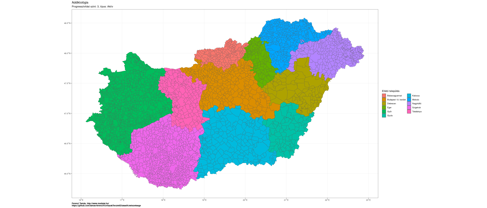
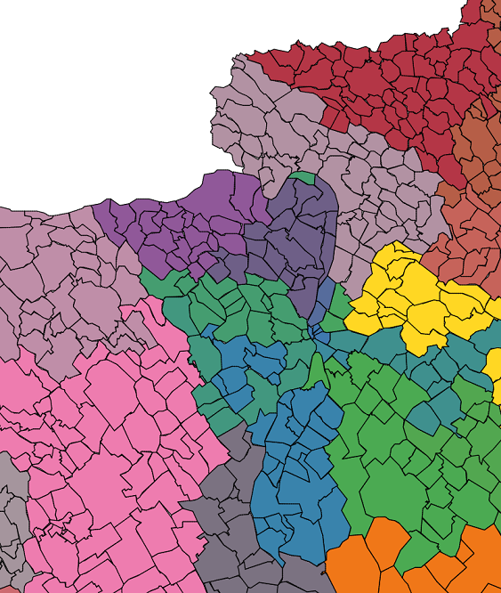
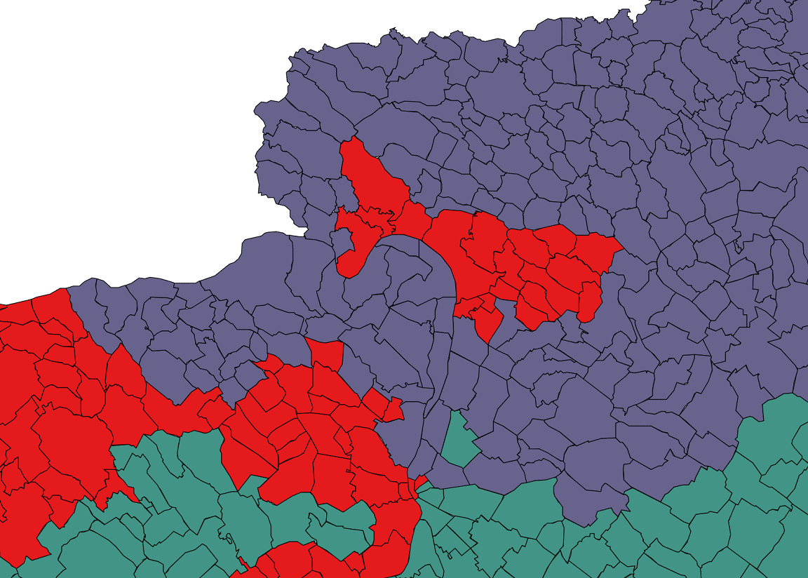
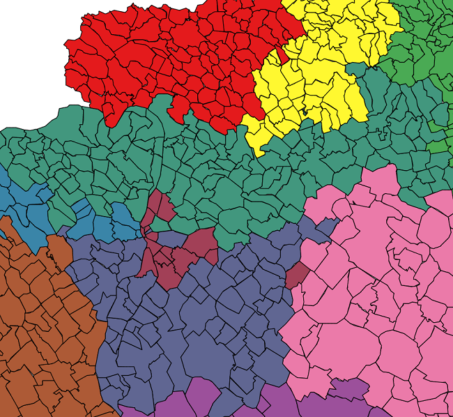

```{r setup, include=FALSE}
knitr::opts_chunk$set(echo = TRUE, fig.width = 16/3*2, fig.height = 9/3*2, dpi = 300, dev = "ragg_png")
library(data.table)
TEKData <- readRDS("TEKres_full_20221207.rds")
locs <- as.data.table(readRDS(url("https://github.com/tamas-ferenci/MagyarorszagKozutiElerhetoseg/raw/main/locs.rds")))
```

## Háttér

Bármely fekvőbeteg-ellátó -- hétköznapilag szólva: kórházi -- rendszer megszervezésének egyik alapkérdése, hogy a kórházak helyét és jellemzőit adottságnak véve hogyan határozzuk meg, hogy adott beteget melyikben fogják ellátni. A mai magyar egészségügyben két elv érvényesül, mely választ ad erre a kérdésre. Az egyik a feltalálási hely elve, ez azt mondja, hogy a beteget abban a kórházban kell ellátni, ami térben a legközelebb van ahhoz, ahol a beteg van a megbetegedésének jelentkezésekor; tipikusan ez érvényesül a sürgősségi szakterületeken. A másik a lakóhely elve, ezt jellemzően a nem sürgőssi területeken alkalmazzák, ilyenkor egy "hozzárendelési listát" tervezünk, ami megadja, hogy adott lakóhelyű beteget melyik kórházban kell ellátni. A tervezési kérdés tehát az, hogy mi lesz az optimális hozzárendelés?

Valójában az a kép, amit fent sugalltam, hogy ti. a lakóhelyeket kell a kórházakkal összepárosítani, még leegyszerűsítettnek is csak hatalmas jóindulattal nevezhető. Minimum a következő problémákat kezelni kell:

- Vannak szakmák (szakterületek): nem minden kórház nyújt minden létező szakmában ellátást, sőt a legtöbb kórház a legtöbb területen nem nyújt ellátást. Emiatt a hozzárendelés a szakterülettől is kell, hogy függjön, lehet, hogy ugyanaz a beteg egyik bajával az egyik, másikkal a másik kórházhoz tartozik.
- A második probléma, hogy még ugyanazon szakterületen belül sem biztos, hogy minden kórház el tud látni minden esetet. Lehetnek speciális műszert, eszközt, szaktudást igénylő ellátások, amiket nem nyújt minden kórház; ezt szokták progresszivitási szintnek nevezni. A magyar rendszer három ilyet definiál, az 1-estől a 3-asig, ahol a 3 legbonyolultabb szint; így a progresszivitástól függően ugyanaz a beteg még ugyanazon szakterületen belül is tartozhat több különböző kórházhoz.
- Végezetül számít az is, hogy aktív vagy krónikus ellátásról van-e szó. Tény, hogy a legtöbb esetben ezt egyértelműen meghatározza a szakma (nincs krónikus szívsebészet vagy aktív légzésrehabilitáció), de bizonyos esetekben, például belgyógyászatnál előfordulhat mindkettő, így ugyanaz a beteg még ugyanazon szakterületen és ugyanazon progresszivitási szint mellett is tartozhat két különböző kórházhoz attól függően, hogy aktív vagy krónikus ellátásra van-e szüksége.

Valójában még a fenti kép is leegyszerűsített (léteznek ún. igényjogosult betegek, akik például munkájukból fakadóan mehetnek bizonyos kórházba, ilyenek a vasutasok vagy a katonák, a kórházaknak van kapacitáskorlátjuk, vagy fizikai vagy adminisztratív stb. stb.), de legalább már hozzávetőlegesen elfogadható, gyakorlati munkára alkalmas.

## Problémafelvetés

A mai magyar rendszerben a fenti gondolatok megjelenési formáját úgy hívják, hogy Területi Ellátási Kötelezettség (általánosan használt rövidítéssel: TEK). A TEK nem más, mint a fenti hozzárendelési tábla, ami a leírt specialitásokat is teljeskörűen figyelembe veszi.

Hol lehet letölteni ezt a táblát? Na, itt kezdődnek a problémák.

A rövid válasz a kérdésre: 2022-ben Magyarországon sehol. Van ugyan egy weboldal (aminél még arra sem vették a fáradságot, hogy domain nevet rakjanak alá), az [X-TEK](http://84.206.43.26:7080/ellatas/xtek/), ahol ez lekérdezhető, de _csak_ úgy, hogy adott település hová tartozik, vagy adott kórházhoz mi tartozik, és mindezekre is kizárólag egy gépi úton fel nem dolgozható lista formájában hajlandó választ adni. Térképet rajzolni, listában szűrni, keresni, sorbarendezni nem lehet, az adatokat egyben letölteni nem lehet, ebből fakadóan további feldolgozást sem lehet rajtuk végezni, nem lehet elemezni, ellenőrizni az adatokat.

Ez részint felháborító, részint védhetetlen (bár sajnos azt nem tudom mondani, hogy [teljesen példa nélküli](https://github.com/tamas-ferenci/GondolatokAJarvanyugyiAdatokKozleserol)...).

Célom volt, hogy ezen a helyzeten változtassak: többszöri letöltéssel, a feldolgozhatatlan eredmények beolvasásával, értelmes formátumra hozásával, majd az eredmények megfelelő összekapcsolásával felépíteni a teljes TEK-táblát, hogy ne csak elvileg legyen nyilvánosan elérhető, hanem gyakorlatilag is. Igyekeztem azt is megmutatni, hogy ezt hogyan kellene a közvélemény számára is bemutatni, ezért demonstrációként elkészítettem egy egyszerű weboldalt, melyben könnyen kereshető, szűrhető, rendezhető az adatbázis, sokféle szempont szerint, és a kapott eredmények nem csak táblázatokban, de interaktív térképen is megjeleníthetőek. Végezetül célom volt az is, hogy meg is mutassam az adatok egy lehetséges felhasználását, és elkészítsem a tábla egy egyszerű adatvalidációját és elemzését, ez utóbbival rámutatva az optimalizáció lehetőségeire is -- amik feltárulnak, ha vannak normálisan elérhető és használható adatok. Az adatokat összekapcsolom a települési lélekszámokkal, és az általam [egy másik projektben](https://github.com/tamas-ferenci/MagyarorszagKozutiElerhetoseg) korábban kiszámolt közúti elérhetőségi adatokkal is, így megpróbálok, ha nagyon kezdetleges módon is, de illusztrációt adna arra is, hogy az ellátást hogyan lehet racionális alapon optimálisan szervezni.

## Összefoglalás

A fenti célt -- megítélésem szerint -- sikerült megvalósítanom.

A teljes magyar TEK-tábla [innen](https://github.com/tamas-ferenci/KorhazakTeruletiEllatasiKotelezettsege/raw/main/TEKres_full_20221207.zip) letölthető tömörített CSV formátumban. Azon túl, hogy tartalmazza az X-TEK rendszer "Listás lekérdezés" oldalán található valamennyi információt, de egybeszerkesztve, gépi úton feldolgozható formában, kiegészítettem pár, a további elemzésekhez hasznos információval: csatoltam a NEAK tábla alapján az ellátó kórház adatai (kódszámok, pontos címek, osztály megnevezése stb.), valamint minden település mellett szerepel a megyéje, járása, jogállása (község, város stb.) és a 2022-es lakónépessége, a KSH [Helységnévtára](https://www.ksh.hu/apps/hntr.main) alapján. Ezen felül megtalálható, hogy a település és az ellátó kórház helye között mennyi a közúti eljutási idő. Ez utóbbi adat egy [másik projektemből](https://github.com/tamas-ferenci/MagyarorszagKozutiElerhetoseg) származik, a részletek leírása ott elolvasható, a lényeg most, hogy egy útvonaltervező alkalmazást használva, gépi úton meghatároztam minden magyar település-pár között a közúti eljutási időt.

Elkészítettem egy egyszerű weboldalt is a fenti adatok számítástechnikai ismereteket nem igénylő, egyszerű, kényelmes, weben keresztül történő lekérdezésére, megjelenítésére és elemzésére, ez a [https://research.physcon.uni-obuda.hu/TEKLekerdezo/](https://research.physcon.uni-obuda.hu/TEKLekerdezo/) címen érhető el.

Végezetül ebben a dokumentumban összefoglalom néhány egyszerű vizsgálat eredményét, melyek részben az adatok validációját, részben a potenciális optimalizálási lehetőségek feltárását szolgálják. Mindkettőre bőven van példa: az adatbázisban több mint 30 ezer hiányos adat van, illetve számos, technikailag valid, de nagyon furcsa hozzárendelés található (távolabbi települések vannak adott kórházhoz rendelve, miközben közelebbiek nincsenek, egy kórház ellátási területe szigetszerűen benne van egy másikéban stb.). Nem merem kijelenteni, hogy ez feltétlenül rosszul optimalizált kiosztás, hiszen lehetnek a háttérben speciális, a rendelkezésre álló adatokból ki nem olvasható körülmények, mindazonáltal egy-két dolog, illetve az ilyen esetek nagy száma meglehetősen gyanús.

## Technikai részletek

Az X-TEK weboldala egy webes formot használ, ezért első ránézésre azt gondolhatnánk, hogy kis ügyességgel összerakhatjuk a beküldendő adatokat és gépi úton begyűjthetjük az összes választ (és így ellátási területet). Sajnos ezzel a módszerrel nem sikerült dűlőre jutnom, mert a form olyan adatokat is elküld, melyeket nem lehet -- vagy legalábbis nekem nem sikerült -- automatizálható módon kitalálnom. Azt még én sem feltételezem, hogy direkt rakták bele, hogy ezt a megoldást nehezítsék, valószínűbbnek tartom, hogy ez egy más célt szolgáló, de történetesen az ilyen letöltést is ellehetetlenítő jellegzetesség. Éppen ezért csak úgy sikerült célt érnem, hogy a Selenium-ot használtam, ez nagyon röviden elmondva egy böngésző automatizálási megoldás: a weboldal úgy látja -- és pontosan azt a bemenetet kapja -- mintha valaki a számítógép előtt ülve kattintgatna, de valójában ezt egy program végzi. A feladat ezt a programot megírni, illetve a weboldal által visszaküldött adatokat lementeni, és az érdemi tartalmat kiszedni. Ennek megvalósításának részleteit a függelékben, egy [külön pontban](#függelék-az-x-tek-adatainak-letöltése) mutatom be.

Ha ezzel megvagyunk, akkor jöhet az adatok tisztítása, adatbázisba rendezése, és kiegészítése az egyéb, további elemzések számára hasznos információkkal. Ennek részleteit szintén [külön pontban](#függelék-az-adatok-tisztítása-és-előkészítése) mutatom be a függelékben.

A számítások megvalósítása `R` [statisztikai környezet](https://www.youtube.com/@FerenciTamas/playlists?view=50&sort=dd&shelf_id=2) alatt készült, `data.table`, `ggplot2` és -- az interaktív térképekhez -- `leaflet` csomagok használatával. Az eredményeket megjelenítő webolda `shiny` segítségével készült, a forráskódját szintén elérhetővé tettem.

A reprodukálhatóság és a nyílt tudomány jegyében a számítást végző valamennyi kód letölthető erről az oldalról. Remélem ez a hibák megtalálását is segíti: bár igyekeztem gondosan eljárni, garancia nincs a tökéletességre, éppen ezért minden észrevételt és kritikát örömmel veszek.

## A honlap működése

A [https://research.physcon.uni-obuda.hu/TEKLekerdezo/](https://research.physcon.uni-obuda.hu/TEKLekerdezo/) címen elérhető honlap működése remélhetőleg kevés magyarázotot igényel.

A bal oldalon kiválaszthatóak a paraméterek, ezek közül is a legalapvetőbb a felső, a `Feladat`. A TEK nagyon alapvető szinten nézve három dolgot rendel össze: települést, szakmát és kórházat, így a kérdésre is háromféleképp nézhetünk rá:

- Adott település melyik kórházhoz tartozik? (Természetesen megadva a szakmát -- és a progresszivitási szinten az aktív/krónikus típussal.)
- Adott szakma esetén hogy van felosztva az ország? (Itt is megadva a progresszivitási szintet és típust.)
- Adott kórház ellátási területe hogy néz ki (Itt az előbbieken túl a szakmát is megadva.)

Az oldal valamennyi kérdés vizsgálatát lehetővé teszi, térképes megjelenítéssel (`Térkép` fül). A bal oldali panel alsó mezőjén állítható, hogy a kép -- letöltve jobban használható -- statikus térkép legyen, vagy számítógépes vizsgálatnál látványos interaktív ábra; ez utóbbi esetben a kurzort a térkép releváns részére húzva hasznos információk jelennek meg. Még egyetlen megjegyzés a bal oldali panelhez: a különböző szűréseket felülről-lefelé érdemes kitölteni; a program figyel arra, hogy mindig aktualizálja a lejjebb lévő mezők tartalmát (tehát ha olyan szakmát választanuk, aminek nincs 1-es progresszivitási szintje, akkor lejjebb, a progresszivitási szint választómezőben meg sem fog jelenni az 1-es). A `Szakma` illetve a `Település` választómezők esetében a tartalom kitörölhető, és egy szövegrészletet elkezdve beírva rákereshetünk arra.

A komplexebb térképek kirajzolása időigényes, itt lehet, hogy néhány másodpercet várni kell, mire frissül az oldal.

A térkép mellett számszerű adatok is elérhetőek az oldalról. A `Táblázat` fül részletes adatokat szolgáltat, abban a szűrésben, ami a bal oldalon be van állítva. A `Statisztika` fül ezzel szemben összevontabb statisztikát mutat, de jellemzően csak a feladat szerinti szűkítésben. (Tehát például szakma lekérdezése esetén a `Táblázat` fülön csak az adott progresszivitási szint és adott típus kórházai jelennek meg, de abból soronként külön-külön az összes, míg a `Statisztika` fülön megjelenik az összes progresszivitási szint és típus, de a kórházakról csak összevont adatok jelennek meg.) Minden táblázat esetében igaz, hogy a fejléc szövegeire kattintva növekvő/csökkenő sorrendbe rendezhető a tartalom adott oszlop szerint, az alatta lévő mezőbe kattintva pedig szűrhetjük a tartalmat. Ez utóbbit segít a táblázat is: ha csak néhány lehetőség van, akkor azok megjelennek felsorolva, ha számszerű az adat, akkor csúszkával szűkíthetünk.

Ha valamilyen adat hiányzik, ez leglátványosabb a térkép esetén, ahol fehér folt jelenik meg, akkor ott a TEK adatbázisa -- a következő pontban leírt okokból kifolyólag -- sajnos minden bizonnyal hiányos.

## Adatvalidáció

Adatvalidáció alatt azt értem, hogy a közölt adatok _elvileg_ lehetnek-e helyesek: koherensek, hiánytalanok, ellentmondásmentesek, szintaktikailag validak-e az X-TEK oldalon közölt területi beosztások.

A Függelék több apróbb problémát ismertet, ezen felül egy kérdés marad mostanra: hogy a területi beosztás hézag- és átfedésmentes-e. Ez egyszerűbben szólva azt jelenti, hogy minden településnek _pontosan_ egy kórházhoz kell tartoznia minden szakmában. Nem lehet az, hogy ugyanaz a település egyszerre két különböző kórházhoz is tartozik, és az sem, hogy valamely település nincs sehová sem rendelve. Ennek biztosítása értelemszerűen elemi minimumkövetelmény egy TEK-rendszernél.

Sajnos az X-TEK rendszere egyik feltételnek sem felel meg. Az még a kisebbik baj, hogy bizonyos települések egyszerre két helyre vannak rendelve. Ezek száma nem túl nagy:

```{r}
knitr::kable(TEKData[, .(`Duplikációk száma` = sum(duplicated(Telepules))),
                     .(`Szakma` = SzakmaNev, `Progresszivitási szint` = Prog, `Típus` = Tipus)][
                       `Duplikációk száma`!=0])
```

A sokkal nagyobb probléma, hogy elképesztően nagy számú település-szakma pár van, amik egész egyszerűen sehová nincsenek rendelve! Hihetetlen, de összesen `r nrow(TEKData[, .(setdiff(locs$NAME, Telepules)) , .(SzakmaKod, ProgClean)])` eset van, amikor nincs definiálva, hogy adott településen élők adott szakterületen hová tartoznak! Kivétel nélkül mind a 3177 magyar település esetén van legalább 1 szakma, ahol nincs TEK meghatározva a X-TEK rendszer Listás keresésében. És nem csak aprófalvakról van szó, hanem mondjuk Debrecenről, ami ráadásul a rekorder is (98 szakma esetén nincs Debrecenhez TEK telepítve), de több mint 100 olyan magyar település van, amelyiknél legalább 50 szakterületnél nincs TEK-kel lefedve a település az X-TEK adatbázisa szerint.

Hozzá kell tennem, hogy ez szinte biztos, hogy a lekérdező-rendszer hibája, ugyanis a debreceni klinikára rákeresve nem dobja ki Debrecent a települések között (márpedig az én adatgyűjtésem ezeket az adatokat szedte le -- ezért lesz hiány), de Debrecenre rákeresve kidobja a debreceni klinikát. Ez persze nem változtat azon, hogy az X-TEK, legalábbis a Listás keresése hibás, vagy azért mert eleve is rosszul töltötték fel, vagy azért, mert a módosítások során nem figyeltek a konzisztencia betartására (esetleg mindkettő egyszerre?). Ezek a hibák továbbmennek az én kimutatásaimba is, de ez nem baj, sőt, direkt jó, hiszen így láthatóvá válnak, ami remélhetőleg elősegíti a kijavításukat.

## Az optimalizáció lehetőségei

Az egyik legizgalmasabb kérdés a TEK-ek kapcsán az optimális ellátási területek meghatározása. Ez kicsit hasonlít ahhoz a kérdéshez, amit korábban az említett [másik írásomban](https://github.com/tamas-ferenci/MagyarorszagKozutiElerhetoseg) már részleteztem, csak itt nem a kórházakat telepítjük, hanem adott kórházhoz jelöljük ki, hogy mely területet lássa le. Ez első ránézésre egyszerű, minden település kerüljön a hozzá legközelebbi kórházhoz, de a valóságban ezt millió szempont bonyolítja (kezdve azzal, hogy a kórházak kapacitása nem végtelen, és nem azonos). Az ilyen és ehhez hasonló, továbbá az egyedi, speciális szempontok miatt dőreség lenne azt gondolni, hogy a válasz pusztán ilyen táblázatok alapján megrajzolható, és így a tényleges beosztás megkritizálható, de mégis, a mai magyar TEK-ben van több olyan eset, aminél legalábbis nagyon gyanús, hogy egyszerűen nem optimális a kiosztás.

De elsőként kezdjünk egy szép, vegytiszta esettel! Az addiktológia szervezése 3-as progresszivitási szinten, aktív ellátásban:



Teljesen tiszta, egyértelmű helyzet. (Bár egyébként itt is látszik, hogy még ebben az esetben sem érvényesül teljesen a "hozzá legközelebbi" elv, jól érzékelhető, hogy célszerű lehet követni a közigazgatási határokat. Adminisztratív okokon túl nagyon könnyen lehet, hogy ez az eljutást is segíti, hiszen az út- és tömegközlekedési hálózat szervezése is követi a megyéket. Ezt természetesen az eljutási időt vizsgáló analízis magától feltárja! -- erre a gondolatra még visszatérek.)

De akkor mi a probléma? Nézzünk néhány példát!

Íme a szülészet (aktív, 2-es progresszivitás):

<p align="center">
  
</p>

A 8. kerületet a 8. kerület látja el, ha átmegyünk Budára, akkor már nem (a 11. kerületet a 11. kerület látja el), de ha még távolabb megyünk, akkor _megint_ a 8. kerület válik az ellátóvá! (Egészen Pusztazámorig.) Ugyanez a helyzet akkor, ha délre indulunk: a 9. kerületet a 9. kerület látja el, a 21.-et a 20., de ha még tovább megyük akkor _megint_ a 8. kerület válik az ellátóvá, egészen le Dömsödig.

Ez azonban semmi az allergológiai ellátáshoz képest:

<p align="center">
  
</p>

A környéken mindent a 6. kerület lát el, ám Vác körül van egy "enklávé" amit a 2. kerület...

Ilyen példák tucatjával találhatóak a magyar TEK-rendszerben!

A személyes kedvencem, gyermekneurológia (2-es progresszivitási szint, aktív):

<p align="center">
  
</p>

30 kilométeres körzetben mindenki máshová tartozik, de egyedül és kizárólagosan Tápióság, ez az egyetlen egy település mégis a 8. kerülethez van rendelve.

Újra hangsúlyozom, hogy ennyi alapján nem jelenthető ki bizonyosan, hogy nem szerencsés az ellátás szervezése, de arra felhívja a figyelmet, hogy mindezt ellenőrizni kell. És természetesen gépi úton, nem hasraütésszerűen nézelődve, mint én tettem most.

Ez pedig elvezet minket az utolsó, és talán legfontosabb gondolathoz. Ahhoz, hogy bár -- épp az említett speciális helyzetek miatt -- a területi beosztás kialakítását soha nem lehet tökéletesen automatizálni, de törekedni kell arra, hogy minél inkább garantált optimum-tulajdonságokkal bíró módon _tervezve_, és nem pedig "érzésből" megrajzolva legyen. A már többször említett [másik írásomban](https://github.com/tamas-ferenci/MagyarorszagKozutiElerhetoseg) részletes példát hoztam arra, hogy milyen optimalizációs megoldások érhetőek el az ilyen problémák kezelésére. Az én adatbázisom tartalmazza -- és ez a weboldalon le is kérdezhető! -- a települések lélekszámát, az eljutási időket, mutatva, hogy milyen információbázisra építhet egy racionális ellátásszervezés. Ehhez a szükséges informatikai és matematikai megoldások rendelkezésre állnak, az alkalmazásukkal, majd a kapott eredmények nyilvánosság előtt történő, transzparens diszkussziójával javítható a kórházi rendszer struktúrája és ennek révén a betegek ellátása.

## Függelék: az X-TEK adatainak letöltése

A letöltéshez az `RSelenium` csomagot használtam. A megvalósítás azon a trükkön alapszik, hogy ha valaki az X-TEK oldalának Listás keresés pontjában az üres mezőre kerestet rá, akkor a weboldal visszaadja az összes kórházat (11 oldalra törve). A szkriptem két ciklust használ: első körben végigmegy ezen a 11 oldalon (szerencsére az URL-jük nagyon szabályos), majd minden oldalon végigmegy a sorokon. Közben több dologra figyelni kell, csak az illusztráció kedvéért, vannak olyan kórházak -- például 3. oldal felülről 2. -- amik egész egyszerűen hibát dobnak, ezért át kell ugorni őket. A dolog még ezen túlmenően sem könnyű, mert a pontos URL-ek csak a gyűjtőoldal ismeretében találhatóak ki, nem feltétlenül egyszerű módokon. De ha mindezen átvergődtünk, akkor is van még egy nagy falat: a megnyitott kórházi oldalakból az érdemi információt hihetetlen nyakatekert XPath hivatkozásokkal lehet kiszedni, ugyanis más lehetőség nincs -- én legalábbis nem találtam -- mint a behozott oldalak alapos nézegetésével belőni, hogy az egyes információk milyen XPath úton érhetőek el.

A mindezeket megvalósító kód:

```{r, eval = FALSE}
driver <- RSelenium::rsDriver(browser = "firefox", chromever = "108.0.5359.71", version = "3.141.59")

tekres <- rbindlist(lapply(1:11, function(oldal) {
  rbindlist(lapply(1:15, function(sor) {
    
    print(paste0(oldal, ": ", sor))
    
    
    if((oldal==3 & sor==2)|(oldal==4 & sor==5)) NULL else {
      driver$client$navigate("http://84.206.43.26:7080/ellatas/xtek/wicket/bookmarkable/oth.ellatas.SzLista")
      
      res <- driver$client$getPageSource()
      res <- rvest::read_html(res[[1]])
      
      res <- rvest::html_attr(rvest::html_elements(res, "a"), "href")
      num <- strsplit(strsplit(res[1], "?", fixed = TRUE)[[1]][2], "-", fixed = TRUE)[[1]][1]
      
      if(oldal>1) {
        if(oldal<11)
          driver$client$navigate(paste0("http://84.206.43.26:7080/ellatas/xtek/wicket/page?",
                                        num, "-1.ILinkListener-lista-navigator-navigation-", oldal-1, "-pageLink")) else
                                          driver$client$navigate(paste0("http://84.206.43.26:7080/ellatas/xtek/wicket/page?",
                                                                        num, "-1.ILinkListener-lista-navigator-last"))
      }
      
      res <- driver$client$getPageSource()
      res <- rvest::read_html(res[[1]])
      
      res <- rvest::html_attr(rvest::html_elements(res, "a"), "href")
      res <- res[seq(3, 31, 2)]
      
      if(!grepl("select", res[sor])) NULL else {
        driver$client$navigate(paste0("http://84.206.43.26:7080/ellatas/xtek/wicket", substring(res[sor], 3)))
        
        res <- driver$client$getPageSource()
        res <- rvest::read_html(res[[1]])
        
        korhaz <- rvest::html_text(rvest::html_node(res, xpath = "/html/body/div[1]/div[4]"))
        
        i <- 1
        szakmak <- character()
        
        while(length(szakma <- rvest::html_text(rvest::html_nodes(res, xpath = paste0("/html/body/div[1]/div[5]/b[", i, "]"))))>0) {
          szakmak <- c(szakmak, szakma)
          i <- i+1
        }
        
        i <- 1
        telepulesek <- character()
        
        while(length(telepules <- rvest::html_text(rvest::html_nodes(res, xpath = paste0("/html/body/div[1]/div[5]/div[", i, "]"))))>0) {
          telepulesek <- c(telepulesek, telepules)
          i <- i+1
        }
        
        seps <- which(telepulesek=="")
        
        rbindlist(lapply(1:(length(seps)-1), function(i)
          data.table(Korhaz = korhaz, Szakma = szakmak[i], Telepules = telepulesek[(seps[i]+1):(seps[i+1]-1)])))
      }
    }
  }))
}))

saveRDS(tekres, "TEKres_20221207.rds")
```

## Függelék: az adatok tisztítása és előkészítése

Az előző pontban létrehozott adatbázis még komoly előkészítést igényel. Elsőként ellenőrizzük, hogy a "Speciális" nevű szakterület nyugodtan eltávolítható (egyik esetben sem tartozik hozzá település), majd ezt követően a nagyon hosszú, és sok -- különböző -- információt tartalmazó `Szakma` oszlopot szétszedjük szemantikusan. Az eredményt minden ponton ellenőrizzük, illetve a progresszivitási szintek kapcsán egy komolyabb adattisztításra is szükség van (a táblában az 1 megtalálható úgy is, hogy `1`, úgy is, hogy `I.` és úgy is, hogy `I`...):

```{r, eval = FALSE}
TEKData <- readRDS("TEKres_20221207.rds")

unique(TEKData$Szakma)

TEKData[Szakma=="Speciális:"]
sum(TEKData[Szakma=="Speciális:"]$Telepules!="")

TEKData <- TEKData[Szakma!="Speciális:"]

# TEKData$Szakma <- gsub(" ", "", TEKData$Szakma)

TEKData$SzakmaKod <- substring(TEKData$Szakma, 1, 4)
TEKData$Szakma <- substring(TEKData$Szakma, 6)

TEKData$SzakmaNev <- trimws(sapply(strsplit(TEKData$Szakma, ":"), `[`, 1))

as.data.table(table(TEKData$SzakmaKod, TEKData$SzakmaNev))[N!=0][order(V1)]

TEKData$Szakma <- trimws(sapply(stringi::stri_split_fixed(TEKData$Szakma, ":", n = 2), `[`, 2))

TEKData$Jelleg <- trimws(sapply(strsplit(TEKData$Szakma, ","), `[`, 1))
unique(TEKData$Jelleg)

TEKData$Szakma <- trimws(sapply(strsplit(TEKData$Szakma, ":"), `[`, 2))

TEKData$Prog <- trimws(sapply(strsplit(TEKData$Szakma, " "), `[`, 1))
unique(TEKData$Prog)
TEKData[Prog=="Nappali"]
TEKData <- TEKData[Prog!="Nappali"]
TEKData$ProgClean <- dplyr::case_when(
  TEKData$Prog%in%c("1", "I", "I.") ~ "1",
  TEKData$Prog%in%c("2", "2a", "2b", "II.", "2.", "2.a.", "II", "II.b") ~ "2",
  TEKData$Prog%in%c("3", "3a", "III.", "3.") ~ "3")
table(TEKData$Prog, TEKData$ProgClean)

TEKData$Szakma <- trimws(sapply(strsplit(TEKData$Szakma, " "), `[`, 2))

TEKData$Tipus <- trimws(sapply(strsplit(TEKData$Szakma, "[()]"), `[`, 2))
unique(TEKData$Tipus)
TEKData$Szakma <- paste0(TEKData$SzakmaKod, " - ", TEKData$SzakmaNev)

unique(TEKData$Korhaz)
TEKData$KorhazNev <- trimws(sapply(strsplit(TEKData$Korhaz, "(", fixed = TRUE), `[`, 1))
TEKData$EgyediKod <- sub(".*\\((.*)\\).*", "\\1", TEKData$Korhaz)
```

Problémát jelent a kórházak adatainak beazonosítása. A fentiekben, ha nem is könnyen, de ki tudtunk szedni egy hatjegyű azonosítót, ezt egyedi kódnak szokták hívni, a gond az, hogy bár a NEAK-nál van [egy lista](http://www.neak.gov.hu/felso_menu/lakossagnak/szerzodott_szolgaltatok/fekvobeteg_ellatast_nyujto_intezmenyek_korhaz.html) az ország összes kórházának összes osztályáról, de ez egy _másik_ kódot használ... Jobb híján kézzel rendeltem össze a kettőt egy külön segédtáblában:

```{r, eval = FALSE}
fwrite(unique(TEKData[, .(Korhaz, EgyediKod)])[order(Korhaz)], "KhNEAKEgyediKi.csv", dec = ",", sep = ";",
       bom = TRUE)
KhLista <- as.data.table(readxl::read_excel("fekvobeteg_szakellato_intezmenyek_telephellyel_202211.xlsx", .name_repair = "universal"))
colnames(KhLista)[colnames(KhLista)=="NEAK.kód"] <- "NEAKKod"
colnames(KhLista)[colnames(KhLista)=="Szakmakód"] <- "SzakmaKod"

KhNEAKEgyedi <- fread("KhNEAKEgyedi.csv", dec = ",")

KhLista <- merge(KhLista, KhNEAKEgyedi[, .(EgyediKod, NEAKKod)], by = "NEAKKod")
```

A gond az, hogy bizonyos esetekben még ugyanazon kórház ugyanazon osztályának is több telephelye van, ráadásul úgy, hogy azoknak még a városa sem ugyanaz. Ilyen esetekben, mivel lehetetlen eldönteni, hogy melyiket kell alapul venni, azt fogom használni, ami a legtöbbször előfordul (ha több ilyen is van, akkor a sorban elsőt, magyarán véletlenszerűen egyet):

```{r, eval = FALSE}
KhLista <- KhLista[, .SD[Telephely.városa==names(sort(-table(Telephely.városa)))[1]][1], .(EgyediKod, SzakmaKod)]
```

Így már befejezhetjük az adatok előkészítését:

```{r, eval = FALSE}
TEKData <- merge(TEKData, KhLista, by = c("EgyediKod", "SzakmaKod"))

TEKData$Telepules[grepl("Budapest", TEKData$Telepules)] <-
  paste0("Budapest ", sprintf("%02d", as.numeric(as.roman(sapply(strsplit(
    substring(TEKData$Telepules[grepl("Budapest", TEKData$Telepules)], 10), ".", fixed = TRUE), `[`, 1)))),
    ". kerület")
TEKData$Telephely.városa[grepl("Budapest", TEKData$Telephely.városa)] <-
  paste0("Budapest ", sprintf("%02d", as.numeric(as.roman(sapply(strsplit(
    substring(TEKData$Telephely.városa[grepl("Budapest", TEKData$Telephely.városa)], 10), ".", fixed = TRUE),
    `[`, 1)))), ". kerület")

table(TEKData$Tipus)
TEKData$Tipus <- ifelse(TEKData$Tipus=="aktív", "Aktív", "Krónikus")

saveRDS(TEKData, "TEKres_proc_20221207.rds")
fwrite(TEKData, "TEKres_proc_20221207.csv", dec = ",", sep = ";", bom = TRUE)
zip("TEKres_proc_20221207.zip", "TEKres_proc_20221207.csv")
```

Utolsó lépésben kiegészítjük a táblát a korábban említett plusz-információkkal:

```{r, eval = FALSE}
locs <- as.data.table(readRDS(url("https://github.com/tamas-ferenci/MagyarorszagKozutiElerhetoseg/raw/main/locs.rds")))
HNTdata <- as.data.table(readRDS(url("https://github.com/tamas-ferenci/MagyarorszagKozutiElerhetoseg/raw/main/HNTdata.rds")))
geodata <- readRDS(url("https://github.com/tamas-ferenci/MagyarorszagKozutiElerhetoseg/raw/main/geodata.rds"))
durationsLong <- readRDS(url("https://github.com/tamas-ferenci/MagyarorszagKozutiElerhetoseg/raw/main/durationsSymmLong.rds"))

TEKData <- merge(TEKData, durationsLong[, .(Telephely.városa = Var1, Telepules = Var2, Duration)],
                 by = c("Telephely.városa", "Telepules"))
TEKData <- merge(TEKData, HNTdata[, .(Telepules = Helység.megnevezése, Helység.jogállása, TelepulesMegye = Megye.megnevezése,
                                      Járás.neve, Lakó.népesség)], by = "Telepules")
TEKData <- merge(TEKData, locs[, .(Telepules = NAME, TelepulesX = X, TelepulesY = Y)], by = "Telepules")
TEKData <- merge(TEKData, locs[, .(Telephely.városa = NAME, TelephelyX = X, TelephelyY = Y)], by = "Telephely.városa")

saveRDS(TEKData, "TEKres_full_20221207.rds")
fwrite(TEKData, "TEKres_full_20221207.csv", dec = ",", sep = ";", bom = TRUE)
zip("TEKres_full_20221207.zip", "TEKres_full_20221207.csv")
```

